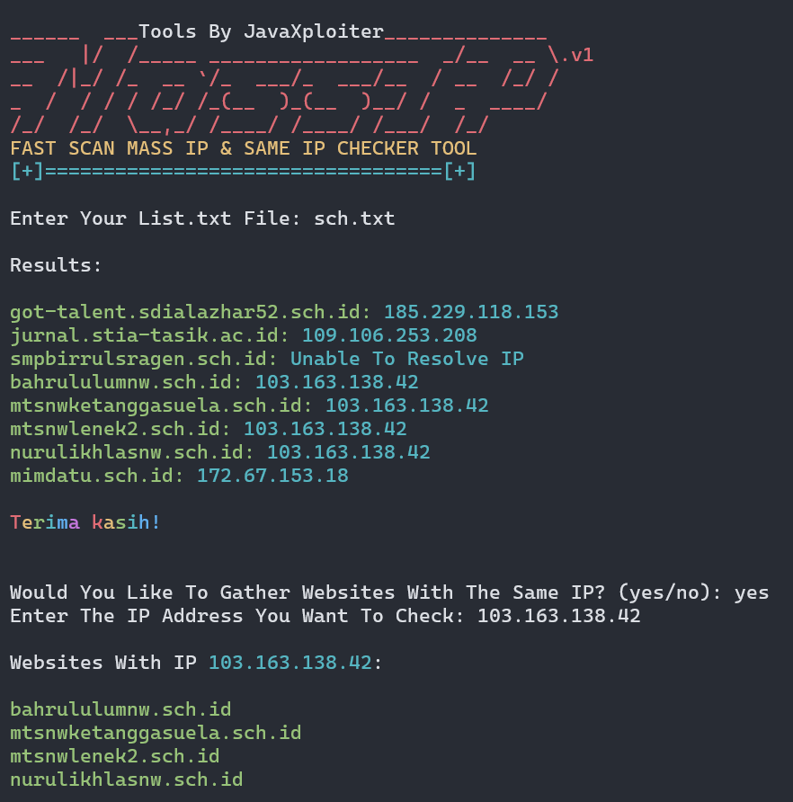

---

# **Fast Scan Mass IP & Same IP Checker Tool**

Tools ini memungkinkan Anda untuk melakukan pemindaian IP cepat dan memeriksa website mana yang berbagi alamat IP yang sama. Tools ini dirancang untuk memproses daftar website dan mengembalikan alamat IP yang sesuai, dengan opsi untuk mengumpulkan semua website yang berbagi alamat IP yang sama.

---

## 📸 Tangkapan Layar


### **✨Fitur**

- 🔍 Pemindaian cepat alamat IP dari banyak website.
- 🌐 Memeriksa website mana yang berbagi alamat IP yang sama.
- 🌈 Menampilkan output berwarna di terminal untuk pengalaman pengguna yang lebih baik.
- 📝 Cara yang sederhana dan efisien untuk memproses daftar URL dari file.

---

### **🔥Persyaratan**

Sebelum menjalankan tools ini, pastikan Anda telah menginstal package Python berikut:

- **colorama**: Digunakan untuk memberi warna pada output terminal.

Anda bisa menginstalnya menggunakan pip:

```bash
pip install colorama
```

---

### **🛠️Cara Menggunakan**

1. **Siapkan File Daftar Website Anda**:
   Buat file teks (misalnya `list.txt`) dengan setiap URL website pada baris baru. Contoh:

   ```
   example.com
   google.com
   github.com
   ```

2. **Jalankan Tools**:
   Clone atau unduh repository yang berisi skrip ini, kemudian jalankan tools menggunakan Python.

   ```bash
   python3 scan.py
   ```

   (Pastikan untuk mengganti `scan.py` dengan nama skrip yang sebenarnya.)

3. **Masukkan Path File**:
   Ketika diminta, masukkan path file `list.txt` yang berisi URL website Anda. Contoh:

   ```
   Enter Your List.txt File: list.txt
   ```

4. **Lihat Hasil**:
   Tools ini akan mencetak setiap website dan alamat IP yang sesuai. Website yang memiliki IP yang sama akan dikelompokkan bersama.

   Contoh output:

   ```
   Websites With IP 192.168.1.1:
   example.com
   google.com
   ```

5. **Opsional: Mengumpulkan Website Dengan IP Yang Sama**:
   Jika Anda ingin memeriksa website mana yang berbagi IP yang sama, ketik `yes` ketika diminta:

   ```
   Would You Like To Gather Websites With The Same IP? (yes/no): yes
   Enter The IP Address You Want To Check: 192.168.1.1
   ```

   Tools ini akan menampilkan semua website yang berbagi alamat IP tersebut.

6. **Selesai**:
   Setelah pemindaian dan pemeriksaan IP opsional, tools ini akan menampilkan pesan terima kasih:

   ```
   Terima kasih!
   ```

---

### **🤝Kontribusi**

Silakan fork repository ini, buka issue, atau kirim pull request untuk meningkatkan tools ini.

---

# **Dukung Saya di Saweria**

Halo! 👋 Jika Anda menikmati tools, skrip, atau konten yang saya buat, Anda bisa mendukung saya melalui **Saweria**. Dukungan Anda membantu saya terus mengembangkan dan memelihara proyek-proyek seperti ini!

### **Cara Mendukung**

Anda bisa berdonasi melalui tautan berikut:

<a href="https://saweria.co/AsmaraHancur" target="_blank"></a>

---

### **Kenapa Mendukung?**

Dukungan Anda membantu saya untuk:
- Memelihara dan meningkatkan tools yang saya kembangkan.
- Membuat lebih banyak sumber daya dan tutorial.
- Menjaga proyek tetap open-source dan gratis untuk semua orang.

---

### **Cara Berdonasi**

1. Klik tombol atau tautan untuk mengunjungi halaman Saweria saya:  
   [Dukung Saya di Saweria](https://saweria.co/AsmaraHancur)

2. Pilih jumlah yang ingin Anda kontribusikan dan ikuti proses donasi.

---

### **Terima Kasih! 🙏**

Setiap kontribusi sangat dihargai. Meskipun Anda tidak dapat berdonasi, membagikan tools saya dengan orang lain atau memberikan umpan balik juga sangat membantu!

---

### **Kontak**

Jangan ragu untuk menghubungi saya jika Anda memiliki pertanyaan atau ingin berkontribusi dengan cara lain. Saya selalu terbuka untuk umpan balik!

---

### **Ikuti Saya**

Anda juga bisa mengikuti saya di platform lain:

- [GitHub](https://github.com/AsmaraHancur)
- [Telegram](https://t.me/AsmaraHancur)
- [Twitter](https://twitter.com/AsmaraHancur)

---

### **Lisensi**

Proyek ini dilisensikan di bawah Lisensi MIT - lihat file [LICENSE](LICENSE) untuk detail lebih lanjut.
